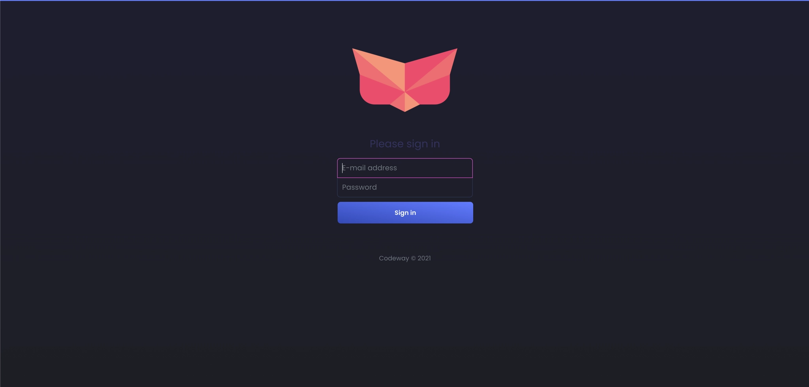
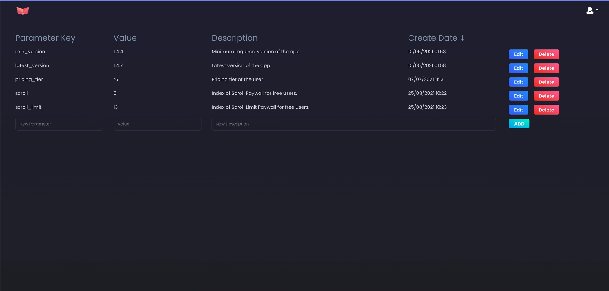
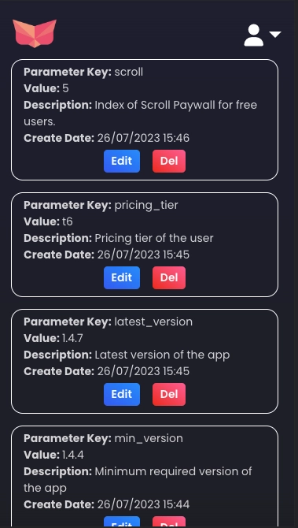

# **Full-Stack Case Study - Codeway**

---

**Goal:** Build a configuration management panel and REST API that serves configuration files for mobile apps.

**Frontend:** VueJS

**Backend:** NodeJS

**Database:** Firestore

**Auth:** Firebase Authentication

---

### **🧭 Overview**

Our mobile applications fetch configuration files whenever the app launches and use these files for app logic and UI configuration. There is a panel and backend servers to provide this service. Application managers can add or change data in configuration files using the panel.
You are asked to create a configuration management panel and REST API for serving these configuration JSON files for the applicat ions. VueJS for the front end and NodeJS for the back end are required.

- You need to build a panel, on which users can log in and update the configuration parameters. (Please see the provided images for the basic version of the UI - this is not the final version)
- You need to build a REST API that serves the configuration for the app in the JSON format.
- You should prevent conflicts while editing parameters (for example if two users are editing the parameters at the same time, later edit should not overwrite the changes of the earlier)

### **Implementing Country Audiences**

Add a functionality to create audiences based on specific countries and serve configuration files tailored to the client’s location. You can assume the client’s country will be provided as a parameter when mobile clients send requests to your backend server.

This functionality must be manageable via the admin panel for each parameter. Make the necessary design changes (to provided screenshots) to support this, such as using a **modal** or a **new page** to edit parameter values for different countries.

**Example Scenario:**
Suppose you want the latest version of the app to be available only to users in Turkey. If a client sends a request with the country parameter set to **"TR"**, they should receive the `latestVersion` parameter as **"2.2"**. If any other country is specified, or if the country parameter is missing from the request, they should receive the default `latestVersion` of **"2.1"**.

**AI-Assisted Flow:**
Setting unique parameter values for every targeted country can be time-consuming for app managers. To solve this, introduce an **AI-assisted flow** that generates suggested values for different country audiences based on the parameter's default value.

This feature is intended to help application managers operate country configuration changes at scale. The AI should serve as an **assistive tool** rather than an automated decision-maker; managers must review and approve the suggestions. You may decide which countries the AI proposes values for (simplest example could be targeting countries with the highest GDP, but you can think on a better logic yourself). The integration can rely on a publicly available API or model, such as GPT models in free limits.

> ⚠️ In this case, we used screenshots as design references to challenge you — but note that in our actual workflow, we always use **Figma designs.**

---

### **🧩 Objective**

Design and develop a configuration management system with:

- A secure, responsive web panel for managing configuration parameters.
- A backend service that stores and serves configuration data to mobile apps in JSON format.
- Proper concurrency control and token validation mechanisms.

---

### **🔐 Panel (Frontend)**

- You are provided with 2 page screenshots: homepage (“/”) , sign in page (“/signin”),
- The design screenshots provided are **for reference only** and do **not** show how the _Country Audience_ parameter values should be edited. You are expected to **create your own designs for the Country Audience section**, based on the requirements explained above, and apply them on top of the provided base designs.
- Parameter values can be in different formats including JSON. Please ensure the value input field is updated to accommodate these different data formats accordingly.
  - Design your pages to be responsive ( Please see provided mobile view of parameters page).
- Please use firebase auth for the authentication.
- Any request should be sent to backend with firebase id token in “authorization” header.

📸 _Example Screenshots:_

- **Login Page:**
  
- **Parameters Panel (Desktop):**
  
- **Mobile View:**
  

---

### **⚙️ Backend**

- You need to develop necessary endpoints that panel users and mobile client users can send their requests.
- For the update, you should validate the firebase id token and for the serving part, a pre-defined api token should be checked.
- To store the configurations of the app, use Firestore database service.
- Use environment variables whenever necessary and avoid hard-coding information, so that your application is always ready to deploy anywhere. Include detailed deployment instructions in the README file, ensuring users can deploy and test the code with their own credentials. Provide an example .env file for necessary environment variables. Don’t forget to specify frontend environment variables as well and include an example in the README for a seamless setup process.

---

### **🧾 JSON Example**

A Sample JSON config that serving API should send as a response:

```jsx
{
  "freeUsageLimit": 5,
  "supportEmail": "support@codeway.co",
  "privacyPage": "https://codeway.com/privacy_en.html",
  "minimumVersion": "1.0",
  "latestVersion": "2.1",
  "compressionQuality": 0.7,
  "btnText": "Try now!",
	"paywallStructure": "{\"products\":[\"plantapp_weekly\",\"plantapp_yearly\"],\"layoutType\":\"custom_layout\",\"is_ft_active\":true}"
	"placeholderText": "Show me the diseased parts.",
}
```

---

### **🧱 Requirements**

1. Try to find the balance between clear architecture and keeping it simple.
2. Follow industry standards when storing and serving the results.
3. Source code should be uploaded to a private **Gitlab** repo.
4. UI should be as close as possible to the example images.
5. Separation of services is a plus.

6- **Deploying** your app on a cloud solution (like Heroku or Google Cloud or any other) and providing us the API endpoints as well as panel url is **required**.

---

### **🧮 Evaluation Criteria**

Evaluation will be made with respect to following items:

1. Code design patterns.
2. Code repetition will be criticized.
3. Inefficient practices will be criticized. Keep in mind that the service will be running under massive traffic.
4. A comprehensive README is essential. Include sections outlining the system’s functionality and deployment steps for clarity.
5. Proper and responsible LLM integration.

**Notes**

---

- Please complete the case within **7 days**, in line with the agreed deadline.
- Please share the **private** **GitLab** repo link (make sure **devenes**, **yasinkuyuk7** and **kutay1** given Reporter role), **deployment urls**, **email and password.** (for signin in to given deployment url of your case study) with us after completing the case.
- For any questions or comments about this case, feel free to reach out to ivana@codeway.co
- Take notes for **AI usage log** describing how you used AI tools working on this case study, including what types of problems they were consulted for (e.g., understanding requirements, exploring alternatives, debugging), and how the outputs were evaluated, adapted, or validated before use. We may discuss this in technical interview.
